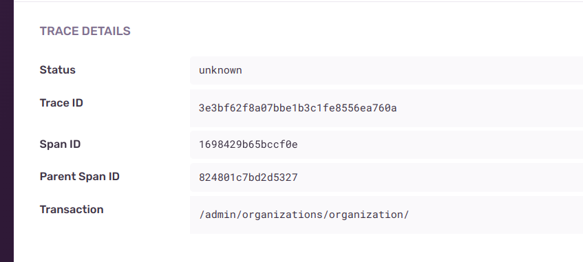

# Настройка opentelemetry в Авто.

Всем привет! Этот гайд будет основан на подключении телеметрии в проекте Авто, а так 
же подключение и отправка traice_ID в sentry. У нас на проекте используется Django.

Opentelemetry - это набор библиотек и инструментов предназначенные для сбора метрик, логов и трассировки, подробнее можно почитать на [ВИКИ](https://wiki.skbkontur.ru/pages/viewpage.action?pageId=649627602).


## Установка необходимых зависимостей
**Пакеты Контура:**

- `kontur_http_toolkit[opentelemetry]`
Для сбора данных с нашей библиотеки kontur_http_toolkit в нее интегрирована [opentelemetry-instrumentation](https://git.skbkontur.ru/py-libs/kontur_http_toolkit/-/tree/master/kontur/httptoolkitopentelemetry?ref_type=heads) В readme указанно как ее установить.

- `kontur_opentelemetry`
Эта библиотека добавляет propagators: kontur и vostok. propagators - это такие механизмы, которые позволяют переносить трассировки и метрики через границы сервисов с помощью заголовков
Так же библиотека предоставляет конфигурацию для подключения телеметрии

**Сторонние пакеты:**

- `opentelemetry-instrumentation-django`
Пакет для автоматического инструментирования Django-приложений нужен для интеграции Opentelemetry в проекты на Django

- `opentelemetry-sdk`
Пакет для сбора, обработки и экспорта данных телеметрии для Python, включает в себя TracerProvider и SpanProcessor

- `opentelemetry-exporter-otlp-proto-grpc`
Используется для экспорта собранных телеметрических данных в коллектор или систему мониторинга

- `opentelemetry-instrumentation-httpx` Библиотека помогает собирать телеметрию, 
  такую как трассировки и метрики

- `sentry-sdk[opentelemetry, django]` Sentry - Библиотека предназначена для 
  мониторинга и 
  отслеживания ошибок и исключений в 
  приложениях

## Создадим файл с настройками `telemetry.py`

[Ссылка на пример](https://git.skbkontur.ru/py-libs/kontur_opentelemetry/-/blob/cf72a3036b365cab5c4428271a5ce5b8351c8dc2/examples/servers/django/manage.py)

```python
from kontur.httptoolkitopentelemetry import HttpxTransportInstrumentor
from kontur.opentelemetry.trace import configure as configure_trace
from opentelemetry import trace
from opentelemetry.instrumentation.django import DjangoInstrumentor
from opentelemetry.propagate import propagators
from sentry_sdk.integrations.opentelemetry import SentryPropagator, SentrySpanProcessor


def configure():
    # Вызываем конфигурацию с kontur.opentelemetry
    configure_trace()
    # по ссылке на пример можно посмотреть другие конфиги

    # Настройки для sentry, надеимся что их в будущем добавят в kontur_opentelemetry
    # Получаем TracerProvider
    provider = trace.get_tracer_provider()
    # Добавляем спан процессор sentry
    provider.add_span_processor(SentrySpanProcessor())  # type: ignore[attr-defined]
    # Добавляем пропагатор sentry
    propagators.append(SentryPropagator())

    # Инструментирование Django
    DjangoInstrumentor().instrument(tracer_provider=provider)
    # Инструментирование http toolkit
    HttpxTransportInstrumentor.instrument(tracer_provider=provider)
```


## Подключение

Подключение происходит в файле manage.py

```python
import os
import sys
import telemetry

if __name__ == "__main__":
    os.environ.setdefault("DJANGO_SETTINGS_MODULE", "auto.settings")

    telemetry.configure()

    try:
        from django.core.management import execute_from_command_line
    except ImportError as exc:
        raise ImportError(
            "Couldn't import Django. Are you sure it's installed and "
            "available on your PYTHONPATH environment variable? Did you "
            "forget to activate a virtual environment?"
        ) from exc
    execute_from_command_line(sys.argv)
```

## У нас используется guicorn, для него нужен отдельный конфиг `gunicorn.config.py`
[ссылка на доку](https://opentelemetry-python.readthedocs.io/en/latest/examples/fork-process-model/README.html)
```python
import telemetry


def post_fork(server, worker):
    telemetry.configure()
```

## В докере в настройках guicorn надо указать путь к конфигу
```yaml
command:
    - gunicorn
    - --bind=0.0.0.0:8000
    - --access-logfile=-
    - --error-logfile=-
    - --log-level=info
    - --config=gunicorn.config.py  <---
    - --enable-stdio-inheritance
    - --reload
    - auto.wsgi
```

Настройки енв
```python

# Прописываем пропогаторы которые будут использоваться для контекстной передачи данных
OTEL_PROPAGATORS: "tracecontext,kontur,vostok"
# Настройка сжатия данных при отправке телеметрических данных через OTLP
OTEL_EXPORTER_OTLP_COMPRESSION: "gzip"
# Точка к которой экспортёр должен отправлять телеметрические данные
OTEL_EXPORTER_OTLP_ENDPOINT: "https://opentm-cloud.kontur.host" # (Прод - "https://opentm.kontur.host")
# Сервис, который генерирует телеметрические данные
OTEL_SERVICE_NAME: "django-auto"
# Указывает выводить трассировки в консоль или нет 
OTEL_DEBUG: "True"
# Включаем или выключаем конфигурирование
OTEL_SDK_DISABLED: "False"
```


Теперь в заголовках запроса можно получить Trace-Id
```
{
  'X-Kontur-Trace-Id': '23d72662837132063bb2cf7df4e2a01d'
}
```

И просмотреть результат трассировки в сервисе https://mon.kontur.ru/contrails/

Например: https://mon.kontur.ru/contrails/23d72662837132063bb2cf7df4e2a01d


В Sentry в разделе `TRACE DETAIL`  можно получить теперь traice_ID и так же 
просмотреть детальную трассировку в сервисе.




Отдельное спасибо за помощь в подключении телеметрии Алексею Горбову

Надеюсь эта статья поможет с настройкой телеметрии. Всем добра!
